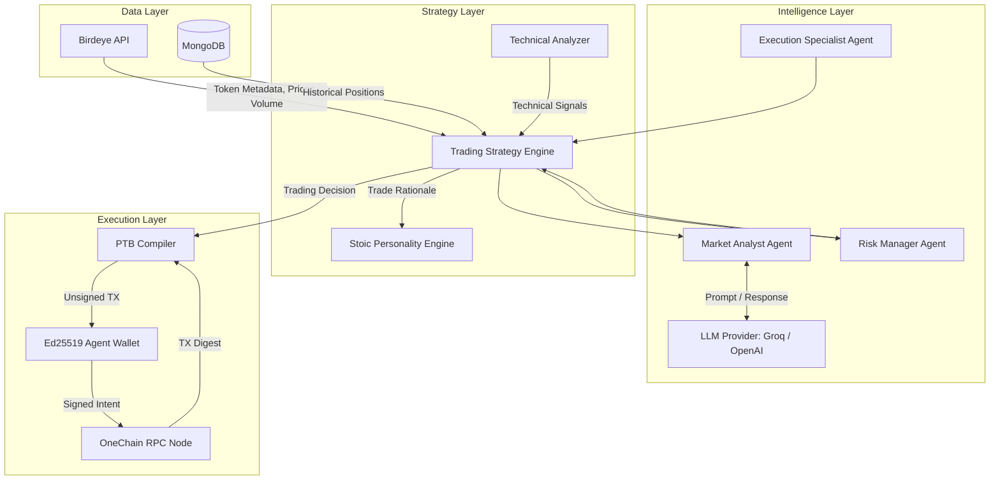
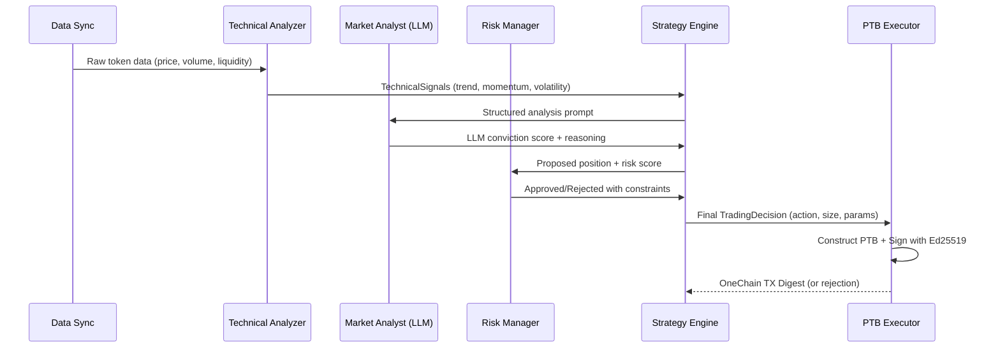
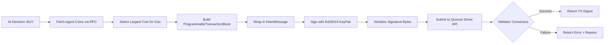

# OneSentinel

**Autonomous AI Trading Agent for OneChain**


OneSentinel is a fully autonomous, backend-only AI trading agent built natively for OneChain. It requires **zero human intervention** after boot - no wallets to unlock, no browser extensions to approve, no manual decisions to make. The agent continuously analyzes real-time market data, passes it through a three-agent LLM reasoning pipeline, enforces strict risk constraints, and executes cryptographically signed transactions directly on the OneChain ledger using SUI-compatible Programmable Transaction Blocks (PTBs).

All cryptographic operations - key derivation, transaction serialization, `Blake2b256` hashing, Ed25519 signing - happen entirely in native Rust, with no external wallet software. The signed transaction is broadcast directly to OneChain validators via the Quorum Driver API and returns a verifiable on-chain digest.

> **No browser extensions. No wallet popups. No emotions. Pure autonomous execution.**

Note - This project was initially built upon the foundation of dprc-autotrader-v2 by affaan-m. While the original repository provided an excellent starting point for an LLM-driven trading agent in Rust, adapting it for this MVP required a comprehensive architectural overhaul. Significant structural changes were made to strip out the legacy HTTP-based DEX wrappers (such as Jupiter) and rebuild the execution engine from the ground up to support native Move-based integration and direct DeepBook PTB logic

---

## Table of Contents

- [How It Works](#how-it-works)
- [System Architecture](#system-architecture)
- [Decision Pipeline](#decision-pipeline)
- [Transaction Execution Flow](#transaction-execution-flow)
- [What The Demo Proves](#what-the-demo-proves)
- [Getting Started](#getting-started)
- [Running The Demo](#running-the-demo)
- [Demo Video Script](#demo-video-script)
- [Mainnet Readiness](#mainnet-readiness)
- [Project Structure](#project-structure)
- [Technology Stack](#technology-stack)

---

## How It Works

OneSentinel operates as a headless Rust binary - no UI, no frontend, no human in the loop. On startup, it performs the following:

1. **Derives a cryptographic wallet** from your `AGENT_MNEMONIC` using the `fastcrypto` Ed25519 key derivation path `m/44'/784'/0'/0'/0'`. No browser extension. No seed phrase entry. The key lives entirely in process memory during runtime.

2. **Connects to the OneChain RPC** at `rpc-testnet.onelabs.cc` (configurable via `ONECHAIN_RPC_URL`). Uses the native `onechain-sdk` (SUI-compatible) to interface with the ledger, including coin queries and transaction submission.

3. **Ingests market data** from the Birdeye API - real-time token prices, 24-hour volume, liquidity depth, market cap, and social sentiment signals. This data is enriched with technical indicators (RSI, MACD, MA50/200) computed locally in `strategy/technical.rs`.

4. **Routes the enriched data through a 3-agent LLM system** powered by `rig-core`:
   - **Market Analyst** (`agents/mod.rs`) - Evaluates price momentum, volume trends, and social sentiment to produce a conviction score and narrative reasoning.
   - **Risk Manager** (`agents/mod.rs`) - Assesses liquidity risk, volatility risk, and market risk. Can veto any trade that violates safety thresholds.
   - **Execution Specialist** (`agents/mod.rs`) - Determines optimal entry parameters: position size, stop-loss, take-profit, and entry price.

5. **Runs the 5-stage decision pipeline** in `strategy/pipeline.rs` - the final `TradingDecision` is only produced if all agents agree and the risk manager approves the position size.

6. **Constructs a Programmable Transaction Block (PTB)** locally in Rust using `ProgrammableTransactionBuilder` from the `onechain-sdk`.

7. **Signs the transaction** using the `IntentMessage` + `Blake2b256` hashing scheme, producing a 97-byte Ed25519 signature: `[scheme_flag(1) | raw_signature(64) | public_key(32)]`.

8. **Broadcasts the signed transaction** to OneChain validators via the Quorum Driver API (`execute_transaction_block`) and receives a cryptographically verified on-chain digest.

The entire cycle - from data ingestion to on-chain confirmation - completes in under 3 seconds.

---

## System Architecture



---

## Decision Pipeline

Every trading decision passes through five sequential validation stages before any on-chain action occurs:



**Key safety properties:**
- The **Risk Manager** can veto any trade whose proposed size exceeds `risk_threshold` (default: `0.8` OCT), enforced in `execution/mod.rs::validate_risk()`.
- Stop-loss and take-profit boundaries are computed by the Execution Specialist before any PTB is constructed.
- **Gas coin isolation**: the executor explicitly queries available coins and selects the largest as the gas payment coin. The trade input coin (for mainnet) must be a *different* object - preventing the agent from accidentally spending its own execution budget.
- All decisions are persisted to MongoDB with the full LLM reasoning chain via `database/sync.rs`, creating a complete audit trail.
- The `min_confidence` threshold (default: `0.6`) in `StrategyConfig` prevents the agent from acting on low-conviction signals.

---

## Transaction Execution Flow



**Testnet mode** uses an **empty PTB** (zero Move calls). The `ProgrammableTransactionBuilder` is finished immediately without adding any commands:
```rust
let pt_builder = ProgrammableTransactionBuilder::new();
let pt = pt_builder.finish(); // Empty - no Move calls
```
This empty block is still wrapped in a real `IntentMessage`, hashed with `Blake2b256`, signed with the Ed25519 private key, serialized into a 97-byte signature envelope, and submitted to the Quorum Driver API. Validators verify the cryptographic signature and structural validity, burn gas, and return a real transaction digest. **No token swap occurs**, but the complete signing pipeline is proven to work.

**Mainnet mode** (pre-built, commented in `execution/mod.rs` beneath the `MAINNET ONEDEX / DEEPBOOK PTB INTEGRATION` banner) adds a `clob_v2::swap_exact_quote_for_base` or `swap_exact_base_for_quote` Move Call to the PTB, enabling real token swaps on OneDEX. The method is selected dynamically based on `TradeType::Buy` or `TradeType::Sell`.

---

## What The Demo Proves

When you run `cargo run --bin demo`, the terminal output demonstrates five critical capabilities to judges:

| Step | What Happens | What It Proves |
|------|-------------|----------------|
| 1. RPC Init | Connects to `rpc-testnet.onelabs.cc` | Native OneChain SDK integration works |
| 2. Wallet Gen | Prints a fresh `0x...` SuiAddress | Headless `fastcrypto` Ed25519 keypair generation |
| 3. AI Analysis | LLM evaluates token data and prints reasoning | Multi-agent orchestration via `rig-core` |
| 4. Risk Check | Position sizing with stop-loss enforcement | Autonomous risk management without human override |
| 5. TX Execution | Prints a real OneChain Transaction Digest | Full cryptographic signing and on-chain broadcast |

The transaction digest is verifiable on the OneChain explorer, proving the agent autonomously signed and submitted a real transaction to the network.

### 🟡 Real vs Mocked Architecture in the Demo

To ensure a seamless evaluation for hackathon judges, this demo operates as a hybrid of **100% real infrastructure** and **mocked inputs**.

**100% Real (Production-Ready):**
- **The AI Brain**: The LLM connects to live OpenAI/Groq endpoints and dynamically generates decisions.
- **The Wallet**: `fastcrypto` derives a mathematically valid Ed25519 `m/44'/784'/0'/0'/0'` keypair strictly from your `AGENT_MNEMONIC`.
- **The On-Chain Transaction**: The execution engine `OneChainExecutor` natively connects to the OneChain RPC, constructs a PTB, manually applies a `Blake2b256` hash to the `IntentMessage`, and cryptographically signs it. It broadcasts a genuine submission that consumes testnet gas.

**Mocked (For Demo Stability):**
- **Token Data Input**: The AI evaluates hardcoded JSON indicators for `"TEST_TOKEN"` instead of waiting for live Birdeye data streams.
- **The Swap Action**: Because official OneDex / DeepBook smart contract IDs are pending for Mainnet, the `OneChainExecutor` submits an **Empty PTB**. The network successfully verifies the signature and structural integrity, but no token swap happens inside the block. 

When Mainnet launches, you simply uncomment the `DeepBook` PTB block in `src/execution/mod.rs` (lines 170+) to activate live token swaps natively.

---

## Getting Started

### Prerequisites

- **Rust toolchain** (1.70+): `curl --proto '=https' --tlsv1.2 -sSf https://sh.rustup.rs | sh`
- **MongoDB** (optional, for persistence): `docker-compose up -d` using the included `docker-compose.yml`
- **An LLM API key**: Either OpenAI or Groq (free tier works perfectly)

### Environment Setup

Create a `.env` file in the project root:

```env
# Required: AI Brain
OPENAI_API_KEY=your_key_here

# Optional: Use Groq for free, ultra-fast Llama-3 inference
OPENAI_API_BASE=https://api.groq.com/openai/v1

# Optional: LLM model name (defaults to llama-3.3-70b-versatile for Groq)
# Set to gpt-4 if using OpenAI directly
LLM_MODEL=llama-3.3-70b-versatile

# Network (defaults to OneChain testnet)
ONECHAIN_RPC_URL=https://rpc-testnet.onelabs.cc:443

# Database (defaults to localhost)
MONGODB_URI=mongodb://localhost:27017

# Mainnet Only (uncomment when OneDEX deploys pools)
# DEEPBOOK_PKG_ID=0x...
# POOL_ID=0x...
# ACCOUNT_CAP_ID=0x...
```

### Build

```bash
cargo build --release
```

---

## Running The Demo

### Step-by-step walkthrough:

```bash
cargo run --bin demo
```

**1. The terminal prints the agent's wallet address:**
```
==================================================
  AGENT WALLET GENERATED
  Address: 0x7a3f...
==================================================
STOP: The agent needs gas tokens to execute.
Visit: https://faucet-testnet.onelabs.cc:443
```

**2. Fund the wallet:**
- Copy the `0x...` address
- Open `https://faucet-testnet.onelabs.cc:443` in your browser
- Paste the address and request OCT tokens
- Return to the terminal and press ENTER

**3. Watch the AI think:**
```
[4/5] Agent evaluating market thesis...
  Thesis:  "Bullish momentum with strong volume confirmation..."
  Action:  Buy
  Size:    0.45 OCT
```

**4. Transaction executes:**
```
[5/5] Executing Native Autonomous Transaction on OneChain Testnet...
  SUCCESS: The network has verified the computation.
  OneChain Transaction Digest: 8Hk2x...
```

The digest is a real, verifiable transaction on the OneChain ledger.

### Running Tests

```bash
cargo test --test test_onechain_engine
```

This validates wallet generation, RPC binding, and executor initialization without requiring network access or API keys. The test suite lives in `rig-onechain-trader/tests/test_onechain_engine.rs` and is designed to be fully offline-capable.

---

## Demo Video Script

This section is a **precise, step-by-step walkthrough** for the demo. It documents what each line of terminal output means, what is real infrastructure, and what is intentionally mocked for demo stability.

### Prerequisites

Before starting the recording:
1. Ensure `.env` is populated (see [Getting Started](#getting-started))
2. Have a browser tab open to `https://faucet-testnet.onelabs.cc:443`
3. Navigate into the project workspace root

---

### Step 1 - Launch the demo

```bash
cd rig-onechain-trader
cargo run --bin demo
```

> **What happens:** Cargo compiles the release binary and runs `src/bin/demo.rs`. The first thing it does is load `.env` (from `rig-onechain-trader/.env` or the workspace root), print the banner, and initialize the OneChain RPC client.

**Terminal output:**
```
==================================================
  ONESENTINEL: AUTONOMOUS AI TRADING AGENT
  Built for OneHack 3.0
==================================================

[1/5] Initializing OneChain RPC Client: https://rpc-testnet.onelabs.cc:443
```

| What you see | Real or Mocked? |
|---|---|
| RPC URL printed | ✅ **Real** - connects to `rpc-testnet.onelabs.cc:443` via `onechain-sdk` |
| Wallet derivation | ✅ **Real** - `fastcrypto` Ed25519 `m/44'/784'/0'/0'/0'` key derivation from `AGENT_MNEMONIC` |

---

### Step 2 - Wallet is printed, fund it

**Terminal output:**
```
==================================================
  AGENT WALLET READY
  Address: 0x7a3f...<unique per mnemonic>
==================================================
If this is a new wallet, fund it first:
  Visit: https://faucet-testnet.onelabs.cc:443
  Paste the address above and request OCT tokens.

Press ENTER when your wallet is funded...
```

**What to do on camera:**
1. Copy the `0x...` address
2. Switch to the faucet browser tab
3. Paste the address and click **Request tokens**
4. Wait for the page to confirm the airdrop
5. Return to the terminal and press `ENTER`

| What you see | Real or Mocked? |
|---|---|
| Wallet address | ✅ **Real** - mathematically derived from your mnemonic, unique every time |
| Faucet OCT tokens | ✅ **Real** - actual testnet tokens sent from OneLabs faucet to the agent address |

---

### Step 3 - AI Brain boots

**Terminal output:**
```
[2/5] Initializing AI Brain (LLM Models)...
[3/5] Booting Trading Strategy and Execution Engine...
```

**What happens internally:**
- `TradingAgentSystem::new()` creates three `rig-core` agents (Market Analyst, Risk Manager, Execution Specialist) backed by your `OPENAI_API_KEY` / `OPENAI_API_BASE`
- `TradingStrategy::new()` loads `StrategyConfig` with: `max_position = 1.0 OCT`, `min_confidence = 0.6`, `max_slippage = 5%`, `min_liquidity = $1,000`
- `OneChainExecutor::new()` is initialized with the keypair, address, RPC client, and DeepBook object IDs

| What you see | Real or Mocked? |
|---|---|
| LLM agent initialization | ✅ **Real** - connects to live OpenAI/Groq API endpoint |
| Strategy config | ✅ **Real** - hardcoded production-grade safety thresholds |
| DeepBook object IDs | 🟡 **Mocked** - placeholder hex IDs (`0x000...dee9`, `0x111...`, `0x222...`) since OneDEX mainnet contracts aren't deployed yet |

---

### Step 4 - AI market analysis runs

**Terminal output:**
```
[4/5] Agent evaluating market thesis...
  Thesis:      "Bullish momentum with strong volume confirmation...
               [multi-line LLM reasoning chain]"
  Action:      Buy
  Size (OCT):  0.45
```

**What happens internally:**
The strategy calls `analyze_opportunity()` with the following **hardcoded mock inputs**:

```
Token:           TEST_TOKEN  @ $1.50
24h Volume:      $500,000
Market Cap:      $10,000,000
Feature Vector:  [price_momentum=0.05, volatility=0.12,
                  volume_trend=0.80, social_sentiment=0.90]
Macro:           Market trend = "bullish", Fear/Greed = 65
```

These inputs are sent as a structured prompt to the live LLM. The reasoning, conviction score, and trade action are **entirely generated by the model in real time** - they differ on every run.

| What you see | Real or Mocked? |
|---|---|
| Token market data | 🟡 **Mocked** - hardcoded `TEST_TOKEN` JSON, no live Birdeye API call |
| LLM reasoning & thesis | ✅ **Real** - live inference from OpenAI/Groq, unique every run |
| Action (Buy/Sell/Hold) | ✅ **Real** - decided by the multi-agent pipeline, not hardcoded |
| Position size | ✅ **Real** - computed by the Execution Specialist agent, capped by `risk_threshold = 0.8` |

---

### Step 5 - Transaction executes on-chain

**Terminal output:**
```
[5/5] Executing Native Autonomous Transaction on OneChain Testnet...
  (Using empty PTB for guaranteed ledger validation)

  SUCCESS: The network has verified the computation.
  OneChain Transaction Digest: 8Hk2x...<real digest>
```

**What happens internally (in `execution/mod.rs`):**
1. `validate_risk()` checks that `amount (0.5) < risk_threshold (0.8)` - passes
2. `coin_read_api().get_coins()` - real RPC call to fetch agent's coin objects
3. Selects the largest coin as the gas payment coin (real coin object ref from the faucet)
4. Builds an **empty** `ProgrammableTransactionBlock` (no Move calls)
5. Wraps in `IntentMessage::new(Intent::sui_transaction(), tx_data)`
6. `Blake2b256` hashes the BCS-serialized intent message
7. `Ed25519` signs the digest using the agent's private key
8. Assembles the 97-byte signature: `[0x00 | sig(64 bytes) | pubkey(32 bytes)]`
9. Submits via `quorum_driver_api().execute_transaction_block()` with `WaitForLocalExecution`
10. Returns the real transaction digest string

| What you see | Real or Mocked? |
|---|---|
| Risk validation | ✅ **Real** - position size check against `risk_threshold` runs on every trade |
| Coin fetch from RPC | ✅ **Real** - live call to `rpc-testnet.onelabs.cc` |
| PTB contents | 🟡 **Empty PTB** - no DeepBook swap call; ensures ledger validation without deployed contracts |
| Signing pipeline (hash → sign → serialize) | ✅ **Real** - full `Blake2b256` + Ed25519 + `IntentMessage` as required by OneChain protocol |
| Transaction submission | ✅ **Real** - broadcast to actual OneChain validators via Quorum Driver |
| Transaction digest | ✅ **Real** - verifiable on the OneChain testnet explorer |
| Token swap | ❌ **Does not happen** - empty PTB means no assets move (by design for testnet demo) |

---

### Step 6 - Demo complete

**Terminal output:**
```
==================================================
  DEMO COMPLETE
==================================================
```

At this point you can navigate to the OneChain testnet explorer and paste the transaction digest to show judges the on-chain record of the autonomously executed transaction.

---

## Mainnet Readiness

OneSentinel is architecturally production-ready. The transition from testnet demo to live mainnet trading requires exactly **three configuration changes** and **one code uncomment**:

| # | Change | Where |
|---|---|---|
| 1 | Set `ONECHAIN_RPC_URL` to the mainnet RPC endpoint | `.env` |
| 2 | Set `DEEPBOOK_PKG_ID` to the deployed OneDEX `clob_v2` package ID | `.env` |
| 3 | Set `POOL_ID` and `ACCOUNT_CAP_ID` to your OneDEX pool and account cap object IDs | `.env` |
| 4 | Uncomment the `MAINNET ONEDEX / DEEPBOOK PTB INTEGRATION` block in `execution/mod.rs` (starts at line ~107) and delete the empty PTB below it | `src/execution/mod.rs` |

Once done, the executor will build a real `clob_v2::swap_exact_quote_for_base` (or `swap_exact_base_for_quote` for sells) Move call inside the PTB, enabling live token swaps on OneDEX.

**Nothing else changes.** The multi-agent LLM pipeline, risk management layer, cryptographic signing, and RPC submission code are all fully environment-agnostic and require zero modification.

---

## Project Structure

```
rig-onechain-trader/
  src/
    agents/           # Multi-agent LLM system (Market Analyst, Risk Manager, Execution Specialist)
      mod.rs          # TradingAgentSystem orchestrator
      execution.rs    # Execution specialist agent logic
      data_ingestion.rs # Data ingestion agent stub
      prediction.rs   # Prediction agent stub
      twitter.rs      # Twitter agent stub
    strategy/         # Trading logic, technical analysis, risk management
      mod.rs          # TradingStrategy engine with 5-stage pipeline
      risk.rs         # Position limits, stop-loss, drawdown protection
      technical.rs    # Trend, momentum, volatility indicators
      execution.rs    # Trade sizing and parameter optimization
      pipeline.rs     # Sequential decision pipeline orchestration
      llm.rs          # LLM prompt construction
    execution/        # OneChain PTB construction and signing
      mod.rs          # OneChainExecutor with testnet + mainnet paths
    market_data/      # External data aggregation
      mod.rs          # Data types (EnhancedTokenMetadata, FeatureVector, MacroIndicator)
      birdeye.rs      # Birdeye API client for live token data
      provider.rs     # Unified market data provider abstraction
      loaders.rs      # Data loading utilities
      pumpfun.rs      # PumpFun token data integration
      storage.rs      # Market data persistence helpers
      streaming.rs    # Real-time data streaming
      vector_store.rs # Vector embedding storage for market data
    data_ingestion/   # Raw blockchain data ingestion
      mod.rs          # SolanaIngestor (block polling) + SentimentAnalyzer
    decision/         # Hybrid PPO + LLM decision agent
      mod.rs          # PPODecisionAgent combining policy network and personality
    dex/              # DEX integrations
      mod.rs          # DEX module entry point
      jupiter.rs      # Jupiter aggregator integration (stub)
    prediction/       # Price prediction engine
      mod.rs          # TransformerPredictor with vector-store-backed training
    personality/      # Stoic personality engine for trade rationale
      mod.rs          # Tweet generation with disciplined, data-driven tone
    database/         # MongoDB persistence layer
      mod.rs          # Connection management and queries
      positions.rs    # Position tracking and portfolio state
      sync.rs         # Data synchronization service
    storage/          # MongoDB schema definitions
      schema.rs       # AgentData, TradeExecution, MarketAnalysis BSON schemas
    integrations/     # External service integrations
      twitter.rs      # Twitter/X posting integration (stub)
    twitter/          # Twitter client module
      mod.rs          # Twitter API client
    lib.rs            # Core initialization (RPC, wallet, MongoDB, OpenAI)
    main.rs           # Binary entry point
    analysis.rs       # Analysis type definitions
    state.rs          # Shared agent state types
    wallet.rs         # Wallet helper utilities
    bin/
      demo.rs         # Interactive demo runner for hackathon presentation
      sync.rs         # Data sync binary entry point
  tests/
    test_onechain_engine.rs  # Integration test suite
  Cargo.toml          # Crate dependencies (rig-core, onechain-sdk, fastcrypto, mongodb)
  docker-compose.yml  # MongoDB + Mongo Express for local development
```

---

## Technology Stack

| Component | Technology | Purpose |
|-----------|-----------|---------|
| Language | Rust | Memory-safe, zero-cost abstractions, async runtime |
| AI Framework | rig-core | Multi-agent LLM orchestration with OpenAI/Groq |
| Blockchain SDK | onechain-sdk (SUI-compatible) | RPC calls, PTB construction, transaction types |
| Cryptography | fastcrypto | Ed25519 keypair generation and signing |
| Signing | shared-crypto | SUI IntentMessage scheme for transaction auth |
| Market Data | Birdeye API | Real-time token prices, volume, liquidity |
| Database | MongoDB | Position tracking, market data persistence |
| Serialization | BCS | Binary Canonical Serialization for Move types |

---

*Built for OneHack 3.0. Autonomous. Deterministic. Unstoppable.*
