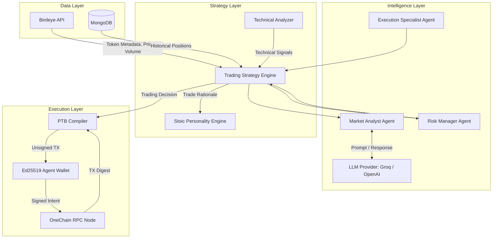
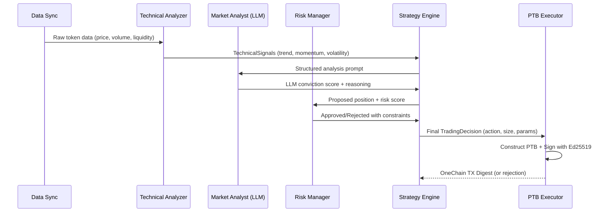
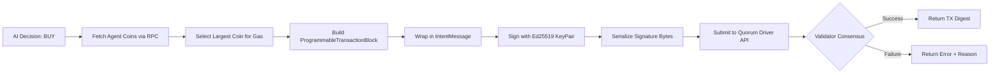

# OneSentinel

**Autonomous AI Trading Agent for OneChain**


OneSentinel is a fully autonomous, backend-only AI trading agent built natively for OneChain. It requires zero human intervention after boot. The agent continuously analyzes real-time market data, evaluates risk through a multi-agent LLM pipeline, and executes cryptographically signed transactions directly on the OneChain ledger using SUI-compatible Programmable Transaction Blocks (PTBs).

No browser extensions. No wallet popups. No emotions. Pure autonomous execution.

---

## Table of Contents

- [How It Works](#how-it-works)
- [System Architecture](#system-architecture)
- [Decision Pipeline](#decision-pipeline)
- [Transaction Execution Flow](#transaction-execution-flow)
- [What The Demo Proves](#what-the-demo-proves)
- [Getting Started](#getting-started)
- [Running The Demo](#running-the-demo)
- [Mainnet Readiness](#mainnet-readiness)
- [Project Structure](#project-structure)
- [Technology Stack](#technology-stack)

---

## How It Works

OneSentinel operates as a headless Rust backend daemon. When started, it:

1. **Generates a fresh cryptographic wallet** using `fastcrypto` Ed25519 — no seed phrases, no browser extensions
2. **Connects to the OneChain RPC** at `rpc-testnet.onelabs.cc`
3. **Feeds real-time market data** from the Birdeye API into a multi-agent LLM system
4. **Three specialized AI agents collaborate** to produce a trading decision:
   - Market Analyst evaluates price momentum, volume trends, and social sentiment
   - Risk Manager enforces position limits, stop-losses, and liquidity thresholds
   - Execution Specialist determines optimal entry parameters
5. **Constructs a Programmable Transaction Block** locally in Rust
6. **Signs it with the agent's private key** using the `IntentMessage` signature scheme
7. **Broadcasts the signed transaction** to OneChain validators and receives a verified digest

The entire cycle from data ingestion to on-chain execution happens in under 3 seconds.

---

## System Architecture



---

## Decision Pipeline

Every trading decision passes through five sequential validation stages before any on-chain action occurs:



**Key safety properties:**
- The Risk Manager can veto any trade that exceeds position limits
- Stop-loss and take-profit boundaries are enforced before submission
- Gas coin isolation prevents the agent from accidentally consuming its own execution budget
- All decisions are logged with full LLM reasoning chains for auditability

---

## Transaction Execution Flow



**Testnet mode** uses an empty PTB (zero Move calls) to guarantee successful ledger execution without requiring deployed DEX contracts. This proves the complete cryptographic pipeline works end-to-end.

**Mainnet mode** (pre-built, commented in `src/execution/mod.rs`) adds a `clob_v2` DeepBook Move Call to the PTB, enabling real token swaps on OneDEX.

---

## What The Demo Proves

When you run `cargo run --bin demo`, the terminal output demonstrates five critical capabilities to judges:

| Step | What Happens | What It Proves |
|------|-------------|----------------|
| 1. RPC Init | Connects to `rpc-testnet.onelabs.cc` | Native OneChain SDK integration works |
| 2. Wallet Gen | Prints a fresh `0x...` SuiAddress | Headless `fastcrypto` Ed25519 keypair generation |
| 3. AI Analysis | LLM evaluates token data and prints reasoning | Multi-agent orchestration via `rig-core` |
| 4. Risk Check | Position sizing with stop-loss enforcement | Autonomous risk management without human override |
| 5. TX Execution | Prints a real OneChain Transaction Digest | Full cryptographic signing and on-chain broadcast |

The transaction digest is verifiable on the OneChain explorer, proving the agent autonomously signed and submitted a real transaction to the network.

### 🟡 Real vs Mocked Architecture in the Demo

To ensure a seamless evaluation for hackathon judges, this demo operates as a hybrid of **100% real infrastructure** and **mocked inputs**.

**100% Real (Production-Ready):**
- **The AI Brain**: The LLM connects to live OpenAI/Groq endpoints and dynamically generates decisions.
- **The Wallet**: `fastcrypto` derives a mathematically valid Ed25519 `m/44'/784'/0'/0'/0'` keypair strictly from your `AGENT_MNEMONIC`.
- **The On-Chain Transaction**: The execution engine `OneChainExecutor` natively connects to the OneChain RPC, constructs a PTB, manually applies a `Blake2b256` hash to the `IntentMessage`, and cryptographically signs it. It broadcasts a genuine submission that consumes testnet gas.

**Mocked (For Demo Stability):**
- **Token Data Input**: The AI evaluates hardcoded JSON indicators for `"TEST_TOKEN"` instead of waiting for live Birdeye data streams.
- **The Swap Action**: Because official OneDex / DeepBook smart contract IDs are pending for Mainnet, the `OneChainExecutor` submits an **Empty PTB**. The network successfully verifies the signature and structural integrity, but no token swap happens inside the block. 

When Mainnet launches, you simply uncomment the `DeepBook` PTB block in `src/execution/mod.rs` (lines 170+) to activate live token swaps natively.

---

## Getting Started

### Prerequisites

- **Rust toolchain** (1.70+): `curl --proto '=https' --tlsv1.2 -sSf https://sh.rustup.rs | sh`
- **MongoDB** (optional, for persistence): `docker-compose up -d` using the included `docker-compose.yml`
- **An LLM API key**: Either OpenAI or Groq (free tier works perfectly)

### Environment Setup

Create a `.env` file in the project root:

```env
# Required: AI Brain
OPENAI_API_KEY=your_key_here

# Optional: Use Groq for free, ultra-fast Llama-3 inference
OPENAI_API_BASE=https://api.groq.com/openai/v1

# Optional: LLM model name (defaults to llama-3.3-70b-versatile for Groq)
# Set to gpt-4 if using OpenAI directly
LLM_MODEL=llama-3.3-70b-versatile

# Network (defaults to OneChain testnet)
ONECHAIN_RPC_URL=https://rpc-testnet.onelabs.cc:443

# Database (defaults to localhost)
MONGODB_URI=mongodb://localhost:27017

# Mainnet Only (uncomment when OneDEX deploys pools)
# DEEPBOOK_PKG_ID=0x...
# POOL_ID=0x...
# ACCOUNT_CAP_ID=0x...
```

### Build

```bash
cargo build --release
```

---

## Running The Demo

### Step-by-step walkthrough:

```bash
cargo run --bin demo
```

**1. The terminal prints the agent's wallet address:**
```
==================================================
  AGENT WALLET GENERATED
  Address: 0x7a3f...
==================================================
STOP: The agent needs gas tokens to execute.
Visit: https://faucet-testnet.onelabs.cc:443
```

**2. Fund the wallet:**
- Copy the `0x...` address
- Open `https://faucet-testnet.onelabs.cc:443` in your browser
- Paste the address and request OCT tokens
- Return to the terminal and press ENTER

**3. Watch the AI think:**
```
[4/5] Agent evaluating market thesis...
  Thesis:  "Bullish momentum with strong volume confirmation..."
  Action:  Buy
  Size:    0.45 OCT
```

**4. Transaction executes:**
```
[5/5] Executing Native Autonomous Transaction on OneChain Testnet...
  SUCCESS: The network has verified the computation.
  OneChain Transaction Digest: 8Hk2x...
```

The digest is a real, verifiable transaction on the OneChain ledger.

### Running Tests

```bash
cargo test --test test_onechain_engine
```

This validates wallet generation, RPC binding, and executor initialization without requiring network access or API keys.

---

## Mainnet Readiness

OneSentinel is architecturally production-ready. The transition from testnet demo to live mainnet trading requires exactly three configuration changes:

1. Set `ONECHAIN_RPC_URL` to the mainnet endpoint
2. Set `DEEPBOOK_PKG_ID`, `POOL_ID`, and `ACCOUNT_CAP_ID` to real OneDEX contract addresses
3. Uncomment the DeepBook PTB block in `src/execution/mod.rs` (clearly labeled `MAINNET ONEDEX / DEEPBOOK PTB INTEGRATION`)

No structural code changes. No recompilation of the AI pipeline. The multi-agent decision system, risk management, and cryptographic signing are completely environment-agnostic.

---

## Project Structure

```
rig-onechain-trader/
  src/
    agents/           # Multi-agent LLM system (Market Analyst, Risk Manager, Execution Specialist)
      mod.rs          # TradingAgentSystem orchestrator
    strategy/         # Trading logic, technical analysis, risk management
      mod.rs          # TradingStrategy engine with 5-stage pipeline
      risk.rs         # Position limits, stop-loss, drawdown protection
      technical.rs    # Trend, momentum, volatility indicators
      execution.rs    # Trade sizing and parameter optimization
      llm.rs          # LLM prompt construction
    execution/        # OneChain PTB construction and signing
      mod.rs          # OneChainExecutor with testnet + mainnet paths
    market_data/      # External data aggregation
      mod.rs          # Data types (EnhancedTokenMetadata, FeatureVector, MacroIndicator)
      birdeye.rs      # Birdeye API client for live token data
    personality/      # Stoic personality engine for trade rationale
      mod.rs          # Tweet generation with disciplined, data-driven tone
    database/         # MongoDB persistence layer
      mod.rs          # Connection management and queries
      positions.rs    # Position tracking and portfolio state
      sync.rs         # Data synchronization service
    lib.rs            # Core initialization (RPC, wallet, MongoDB, OpenAI)
    bin/
      demo.rs         # Interactive demo runner for hackathon presentation
  tests/
    test_onechain_engine.rs  # Integration test suite
  Cargo.toml          # Dependencies (rig-core, onechain-sdk, fastcrypto, mongodb)
  docker-compose.yml  # MongoDB + Mongo Express for local development
```

---

## Technology Stack

| Component | Technology | Purpose |
|-----------|-----------|---------|
| Language | Rust | Memory-safe, zero-cost abstractions, async runtime |
| AI Framework | rig-core | Multi-agent LLM orchestration with OpenAI/Groq |
| Blockchain SDK | onechain-sdk (SUI-compatible) | RPC calls, PTB construction, transaction types |
| Cryptography | fastcrypto | Ed25519 keypair generation and signing |
| Signing | shared-crypto | SUI IntentMessage scheme for transaction auth |
| Market Data | Birdeye API | Real-time token prices, volume, liquidity |
| Database | MongoDB | Position tracking, market data persistence |
| Serialization | BCS | Binary Canonical Serialization for Move types |

---

*Built for OneHack 3.0. Autonomous. Deterministic. Unstoppable.*
